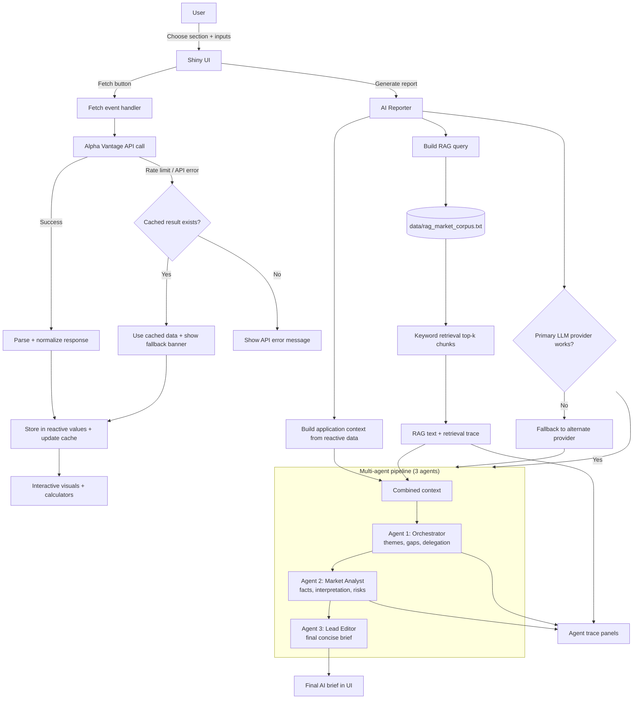

## Process Diagram (Data Flow, Agentic Orchestration, RAG, Fallback)

### Required-feature mapping

- **Agentic orchestration**: 3 role-specific agents with sequential coordination.
- **RAG**: retrieval from custom local data source `data/rag_market_corpus.txt`.
- **Functional app resilience**: Alpha Vantage rate-limit fallback to cached results.
- **UI/visual design**: interactive plots, tooltips, legends, and what-if calculators.

